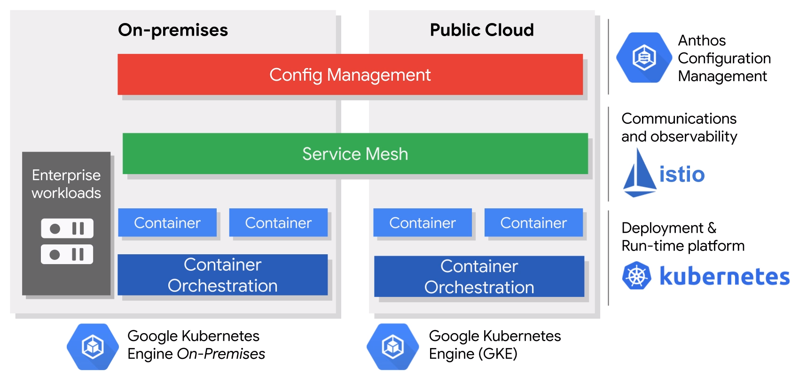
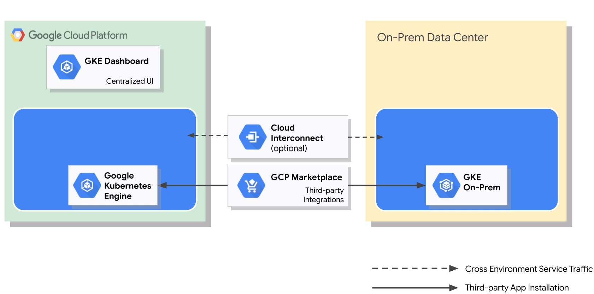
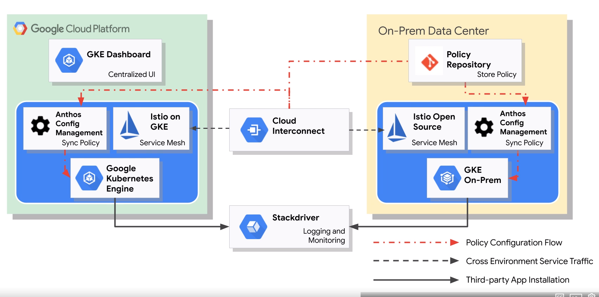

# gpc-anthos
Hybrid Cloud Infrastructure Foundations with Anthos

### Hybrid Cloud Overview

Hybrid environment whishlist

- Write onde, deploy in any cloud
- Accelerate developer velocity
- Consistency across environments
- Interoperability with legacy workloads
- Increased observability and SLO
- Decoupling across critical components
- Increased workload mobility
- Avoid vendor lock in

### Anthos

Anthos is a modern application management platform that provides a unified model for computing, networking, and even service management across clouds and data centers.

- Kubernetes Engine
- GKE On-Prem
- Anthos Config Management
- Istio
- Migrate for Anthos
- Marketplace

The technology stack is built on consisten set of APIs based on open-source technologies which empowers developers and operators with a single methodology that applies to on premise, GCP and other cloud providers.

### Anthos Benefits

* A technology stack that runs in data centers, next to enterprise workloads companies currently run on premise.
* A single application model that empowers developers and operators adopt modern methodologies and promotes agility and productivity.
* A central control plane based on a service centric view, powered by automation and security at scale.

### Anthos in more detail

